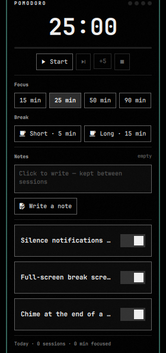
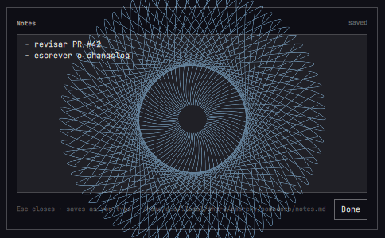

# Pomodoro — focus timer for the Omarchy bar

A pomodoro timer for the [Omarchy](https://omarchy.org) shell. A countdown sits
in the bar next to the clock, a click opens the controls, and every break takes
over the screen with a progress ring so you actually step away. Notifications
are silenced while you focus, a chime marks the end of each block, and the timer
survives shell restarts, theme switches and suspend.

Classic rhythm out of the box: **25 min focus · 5 min break · 15 min long break
after every 4th block**. Everything is a setting.

## The popup


- Big countdown with a progress line and session dots (one per focus block in
  the current set).
- Start / Pause / Resume, skip the current block, add five minutes, stop.
- Focus presets (`15 · 25 · 50 · 90` min by default — right-click one to make
  it the default length).
- Start a short or long break on demand.
- Three toggles: silence notifications while focusing, full-screen break
  screen, chime at the end of a block.
- Today's sessions and focused minutes.

## The break screen


When a focus block ends the break screen covers every monitor: phase title,
a progress ring counting the break down, a short tip, the session dots, and
buttons for Pause, +5 min, Skip break and Stop.

**Press `Esc` to get out of the break screen at any time** — it hides the
overlay for the rest of that break while the timer keeps running in the bar.
`Space` (or `Enter`) skips the break and starts the next focus block. When the
break is over the screen waits for you with a *Start 25 min focus* button
(press `Enter`) rather than starting the next block on its own, so a break that
runs long never silently eats into a focus block. Turn the break screen off
entirely with the popup toggle or the `overlay` setting.

## Bar widget

The bar shows a timer icon when idle, a brain icon plus the countdown during
focus, a coffee cup plus the countdown during a break, and a thin progress
hairline under the label while a block runs.

| Action | Result |
|---|---|
| Left click | Open / close the popup |
| Right click | Start (or pause / resume) |
| Middle click | Skip the current block |
| Scroll | ± 1 minute on the running block |

## Requirements

- Omarchy with the Quattro shell (`omarchy-shell`, Quickshell based).
- `pipewire` (`pw-play`) or `pulseaudio` (`paplay`) for the chime, and the
  freedesktop sound theme (`/usr/share/sounds/freedesktop`) — all standard on
  Omarchy. Set `sound` to `false` if you have neither.
- `python3` (standard library only) for the bundled state reader — a hard
  dependency of Omarchy itself, so nothing extra to install.
- Optional, for the CLI: `jq` (standard on Omarchy).

No sudo or pkexec is required.

## Install

```bash
omarchy plugin add https://github.com/techywilbur/omarchy-pomodoro.git --enable
```

`--enable` places the widget in the bar's center section (you can choose a
section when prompted). To add it later, or move it next to the clock:

```bash
omarchy plugin enable techywilbur.pomodoro
omarchy bar move techywilbur.pomodoro --section center
```

## Update

```bash
omarchy plugin update techywilbur.pomodoro
```

## Remove

```bash
omarchy plugin remove techywilbur.pomodoro
```

That deletes the plugin folder and its bar entry. The only other thing the
plugin creates is its state file, `~/.local/state/uni-pomo/state.json`, which
you can delete by hand. If you installed the optional CLI, menu entries or
keybinds below, remove those the same way you added them.

## Settings

Settings live inline on the widget's entry in `~/.config/omarchy/shell.json`
and can be edited from the Omarchy bar settings panel or the popup toggles.
Changes apply immediately.

| Key | Default | Meaning |
|---|---|---|
| `focus` | `25` | Focus block length in minutes |
| `shortBreak` | `5` | Short break length |
| `longBreak` | `15` | Long break length |
| `longEvery` | `4` | Long break after every Nth focus block (`0` = never) |
| `presets` | `[15, 25, 50, 90]` | Focus preset buttons in the popup |
| `dnd` | `true` | Turn on Do Not Disturb during focus, restore afterwards |
| `overlay` | `true` | Full-screen break screen |
| `overlayDim` | `0.93` | Darkness of the break screen (`0.3`–`1`) |
| `sound` | `true` | Chime at the end of a block |
| `notify` | `true` | Desktop notification at the end of a block |
| `autoStartBreak` | `true` | Focus done → break starts by itself |
| `autoStartFocus` | `false` | Break done → next focus starts by itself (off: wait for you) |
| `soundFocusEnd` | freedesktop `complete.oga` | Sound file played when focus ends |
| `soundBreakEnd` | freedesktop `message.oga` | Sound file played when a break ends |
| `staleAfter` | `30` | Minutes after which a restored, already-ended block is dropped |

Example entry:

```json
{ "id": "techywilbur.pomodoro", "focus": 50, "shortBreak": 10, "presets": [25, 50, 90], "dnd": false }
```

## Optional: CLI, keybinds and menu entries

The repository ships `uni-pomo`, a small bash CLI that talks to the plugin over
IPC. Nothing installs it for you — copy it if you want it:

```bash
install -m 755 ~/.config/omarchy/plugins/techywilbur.pomodoro/uni-pomo ~/.local/bin/uni-pomo
uni-pomo help
```

```
uni-pomo                     short human status
uni-pomo status [--json]     status (JSON with --json)
uni-pomo start | toggle | pause | resume | stop | skip
uni-pomo focus [min]         start a focus block
uni-pomo break [min]         start a short break
uni-pomo long [min]          start a long break
uni-pomo extend <min>        add (or subtract) minutes on the running block
uni-pomo hide | show         hide / show the break screen
uni-pomo panel               toggle the bar popup
uni-pomo get <key>           read a setting
uni-pomo set <key> <value>   write a setting (edits shell.json with jq)
uni-pomo settings            print all settings
```

With the CLI in place, `extras/bindings.lua` adds `SUPER+SHIFT+P` (start /
pause), `SUPER+SHIFT+CTRL+P` (stop) and `SUPER+SHIFT+ALT+P` (popup) — append it
to `~/.config/hypr/bindings.lua`. Note that stock Omarchy binds `SUPER+SHIFT+P`
to Google Photos; the snippet unbinds it first, so pick other keys if you use
that. `extras/omarchy-menu.jsonc` adds a **Pomodoro** entry to the Omarchy menu
(`SUPER+SPACE`) with start / pause, skip, stop, focus lengths, breaks and
✓ toggles — merge it into `~/.config/omarchy/extensions/omarchy-menu.jsonc`.

## IPC

```bash
omarchy-shell pomodoro status                # JSON status
omarchy-shell pomodoro toggle                # start / pause / resume
omarchy-shell pomodoro focus 50              # also: shortBreak, longBreak, extend <min>
omarchy-shell pomodoro skip | stop | pause | resume
omarchy-shell pomodoro hideBreak | showBreak # break screen
omarchy-shell shell toggle techywilbur.pomodoro   # open / close the popup
```

## How it works, and what it touches

- `Service.qml` is the engine: one instance per shell keeps the phase, an
  absolute end time, the set counter and today's stats, and draws the break
  screen on every monitor. `BarWidget.qml` (one per monitor) renders the bar
  label and the popup. `PomoModel.js` is the pure logic.
- Time is stored as a wall-clock end, so a block keeps counting correctly
  through suspend and shell restarts. State is written to
  `~/.local/state/uni-pomo/state.json` on every transition (atomically, via a
  temp file and rename). It is read back only through the bundled
  `pomo-state-read` helper, which opens the directory and file with
  `O_NOFOLLOW` (the file also `O_NONBLOCK`), checks the *open* descriptor is a
  regular file owned by you and at most 16 KiB, caps the read, and hands the
  shell a whitelisted, range-checked object. A planted FIFO, symlink or
  oversized file cannot block or bloat the shell at startup; the timer just
  starts fresh.
- Do Not Disturb goes through the shell's own notifications service; the state
  you had before the focus block is restored when it ends.
- The chime is played with `pw-play` (falling back to `paplay`); notifications
  use `omarchy-notification-send`.
- The plugin writes to `~/.config/omarchy/shell.json` only when you change a
  setting from the popup, and only its own widget entry.
- No sudo or pkexec is required. Nothing is installed outside the plugin folder
  unless you copy the optional CLI yourself.

## Files

```
manifest.json        plugin manifest (kinds: service + bar-widget, settings schema)
Service.qml          engine, persistence, DND, break screen; IPC target `pomodoro`
BarWidget.qml        bar label + popup; IPC target `techywilbur.pomodoro`
PomoModel.js         pure logic: settings parsing, phases, formatting
pomo-state-read      bounded, non-following state reader (python3, stdlib only)
uni-pomo             optional bash CLI
extras/bindings.lua  optional Hyprland keybinds
extras/omarchy-menu.jsonc  optional Omarchy menu entries
screenshots/         popup.png, break.png, notes.png, notes-editor.png
preview.png          marketplace preview
```

## Local changes (this machine)

A small persistent notepad for the pomodoro. The feature is deliberately
isolated so the patch against upstream stays tiny:

- `NotesSection.qml` (new file) holds the whole feature: the preview block that
  goes inside the popup, the editor window, the file plumbing.
- `BarWidget.qml` only adds the `NotesSection` instance in the popup column, one
  IPC entry point (`omarchy-shell techywilbur.pomodoro notes`) and makes
  `opened`/`close()` aware of the editor window. Ten-odd lines, so upstream
  edits to this file rarely conflict with it.

### What it looks like





How it behaves:

- The popup card gains a **Notes** section: a read-only preview of the note plus
  a "Write a note" button.
- Opening the editor dismisses the card, and opening the card dismisses the
  editor. Not cosmetic: the card is an xdg-popup of the bar and stacks *above*
  the editor's layer surface, so leaving it up would bury the editor while you
  type.
- The editor is a `PanelWindow` (`WlrLayershell.namespace: pomodoro-notes`) with
  `WlrKeyboardFocus.Exclusive` while it is up. It cannot live in the popup: a
  bar popup is an xdg-popup on a layer surface and never receives keyboard
  events (verified — synthetic Esc and typed text never arrive), so the editor
  gets its own layer surface, the same shape the break screen uses.
- The note is a plain markdown file at
  `~/.local/share/omarchy/pomodoro/notes.md` (created on first save). Editing it
  in an external editor is fine: the file is re-read when a surface opens, and a
  reload never clobbers text that is dirty in the editor.
- Saving is automatic: 800 ms after the last keystroke, plus a flush when the
  editor closes (`Esc`, `Done`, click outside). Writes go through a write-only
  `FileView` with `atomicWrites: true` (temp file + rename), the same pattern
  `Service.qml` uses for its state file.

Maintenance (this machine): the change is a commit on top of upstream `main`,
published to a fork so both update paths work:

- `origin` = `github.com/maykonsilva2/omarchy-pomodoro` (the fork, includes the
  patch); `upstream` = the author's repo. `git branch -vv` shows `main` tracking
  `origin/main`.
- `pomodoro-update` (in `~/.local/bin`) fetches `upstream`, rebases the local
  commit onto the newest upstream commit, publishes the result to the fork and
  reloads the shell. On conflict it aborts and leaves the checkout untouched.
- `omarchy plugin update` also works now (it pulls the fork and fast-forwards,
  because the fork already carries the rebased commit).
- Reinstalling the plugin with the notes feature: point Omarchy at the fork,
  e.g. `omarchy plugin add https://github.com/maykonsilva2/omarchy-pomodoro`.

## License

[MIT](LICENSE) © 2026 Wilbur Lindqvist
